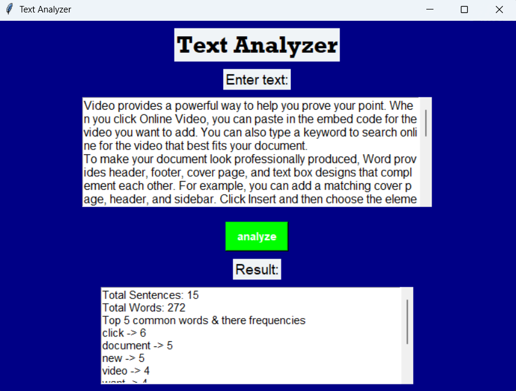

# Text Analyzer

A Python GUI application that performs comprehensive text analysis using Natural Language Processing (NLP) techniques. Analyze text for sentence count, word count, common words, and sentiment analysis with an intuitive graphical interface.

## Features

- **Sentence Analysis**: Count total number of sentences in the input text
- **Word Analysis**: Count total words and identify most frequent words (excluding stopwords)
- **Sentiment Analysis**: Determine if text is positive, negative, or neutral with detailed sentiment scores
- **Stopword Filtering**: Automatically removes common English stopwords for better word frequency analysis
- **User-Friendly GUI**: Clean, intuitive interface built with Tkinter
- **Real-time Analysis**: Instant results displayed in a scrollable text area
- **Comprehensive Reporting**: Detailed breakdown of all analysis metrics

## Requirements

- Python 3.6 or higher
- Tkinter (usually included with Python)
- NLTK (Natural Language Toolkit)
- Internet connection (for initial NLTK data download)

## Installation

### 1. Clone the Repository

```bash
git clone https://github.com/AdvaySingh-9/text-analyzer
cd text-analyzer
```

### 2. Install Dependencies

```bash
pip install nltk
```

**Note**: Tkinter usually comes pre-installed with Python. If you encounter import errors, install it using:

- **Windows**: `pip install tk`
- **macOS**: Tkinter comes with Python from python.org
- **Linux**: `sudo apt-get install python3-tk` (Ubuntu/Debian)

### 3. Download NLTK Resources

The application will automatically download required NLTK resources on first run:

- `punkt_tab` - Tokenization models
- `stopwords` - English stopwords corpus
- `vader_lexicon` - Sentiment analysis lexicon

Alternatively, you can download them manually:

```python
import nltk
nltk.download('punkt_tab')
nltk.download('stopwords')
nltk.download('vader_lexicon')
```

### 4. Run the Application

```bash
python text-analyzer.py
```

## Usage

1. **Launch the Application**: Run `python text-analyzer.py`
2. **Enter Text**: Type or paste your text into the input area
3. **Analyze**: Click the "analyze" button
4. **View Results**: Check the results area for:
   - Total number of sentences
   - Total number of words
   - Top 5 most common words with their frequencies
   - Overall sentiment (Positive/Negative/Neutral)
   - Detailed sentiment scores (compound, positive, negative, neutral)

## How It Works

### Text Processing Pipeline

1. **Tokenization**: Text is broken down into sentences and individual words using NLTK's tokenizers
2. **Filtering**: Stopwords (common words like "the", "a", "is") are removed to focus on meaningful content
3. **Frequency Analysis**: Word frequencies are calculated using Python's Counter
4. **Sentiment Analysis**: VADER (Valence Aware Dictionary and sEntiment Reasoner) analyzes the emotional tone

### Sentiment Analysis Details

The application uses NLTK's VADER sentiment analyzer which:

- Returns a compound score between -1 (very negative) and +1 (very positive)
- Provides separate scores for positive, negative, and neutral sentiments
- Categorizes text as:
  - **Positive**: compound score ≥ 0.05
  - **Negative**: compound score ≤ -0.05
  - **Neutral**: compound score between -0.05 and 0.05

## Project Structure

```
text-analyzer
├── text-analyzer.py          # Main application file
├── README.md                 # This documentation
└── [nltk_data/]             # NLTK data directory (auto-created)
```

## Dependencies

- **tkinter**: GUI framework (built-in with Python)
- **nltk**: Natural Language Processing library
  - `nltk.tokenize`: For splitting text into sentences and words
  - `nltk.corpus.stopwords`: For filtering common words
  - `nltk.sentiment.SentimentIntensityAnalyzer`: For emotion analysis

## Customization

You can modify the analysis parameters in the code:

```python
# Change number of common words displayed (default: 5)
common_words = word_frequency.most_common(5)

# Adjust sentiment thresholds
if sentiment['compound'] >= 0.05:  # More sensitive: change to 0.01
    sentiment_category = "Positive"
elif sentiment['compound'] <= -0.05:  # More sensitive: change to -0.01
    sentiment_category = "Negative"
else:
    sentiment_category = "Neutral"
```

## Troubleshooting

| Issue                        | Solution                                                               |
| ---------------------------- | ---------------------------------------------------------------------- |
| "Module 'tkinter' not found" | Install tkinter: `pip install tk` (Windows) or system package manager  |
| "NLTK resource not found"    | Run the app once to auto-download, or use `nltk.download()`            |
| "No text entered"            | The app will prompt you to enter text before analysis                  |
| "Empty results"              | Check that your text contains actual content (not just spaces/symbols) |

## Screenshots




## Future Enhancements

- [ ] Support for multiple languages
- [ ] Export results to file (CSV, JSON, PDF)
- [ ] Advanced sentiment analysis with emotion detection
- [ ] Text summarization features
- [ ] Batch processing for multiple texts
- [ ] Word cloud visualization
- [ ] Grammar and spell checking
- [ ] Readability score calculation

## Contributing

Contributions are welcome! Please feel free to submit issues or pull requests.

### Development Setup

1. Fork the repository
2. Create a virtual environment: `python -m venv venv`
3. Activate it: `venv\Scripts\activate` (Windows) or `source venv/bin/activate` (macOS/Linux)
4. Install dependencies: `pip install nltk`
5. Make your changes
6. Test thoroughly
7. Submit a pull request

## License

This project is open source and available under the MIT License.

## Author

Created by a solo developer [Advay Singh](https://advay-portfolio.netlify.app).

## Acknowledgments

- NLTK library for providing excellent NLP tools
- VADER sentiment analysis model for robust emotion detection
- Tkinter for the GUI framework

## Disclaimer

This tool is for educational and analytical purposes. Results may vary based on text complexity, language nuances, and context. For professional text analysis, consider consulting domain experts.
